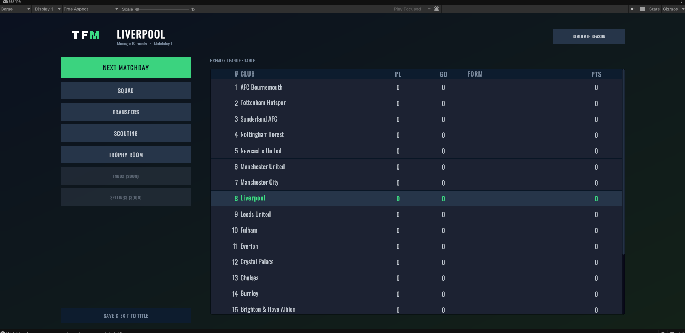
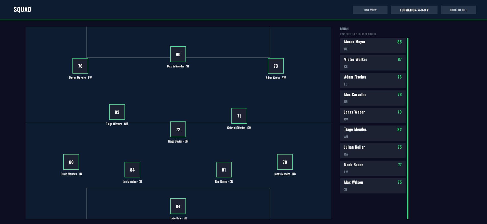
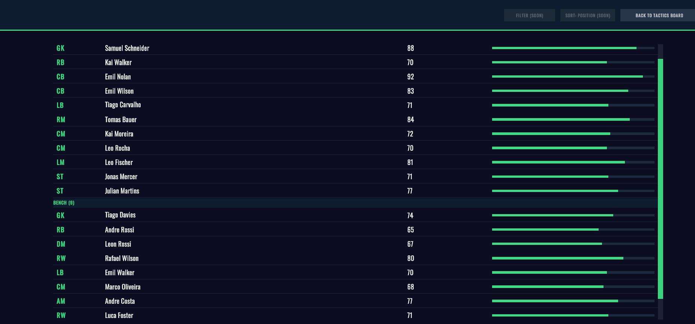
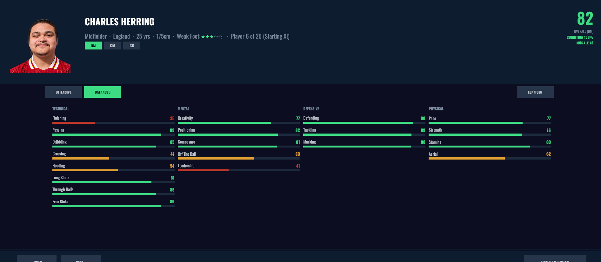
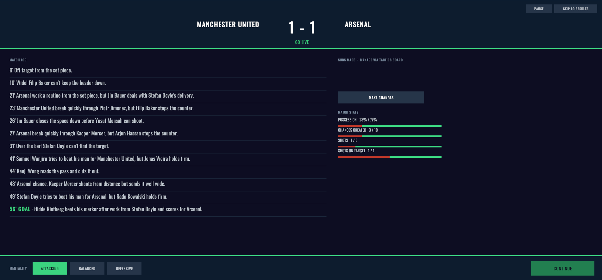

# TFM - Football Management Simulation

A Unity/C# football management simulation with a fully generated world — clubs,
players, transfer history and league tables are procedurally created per save, not
pulled from a real-world database. You manage one club: matchday selection, tactics,
transfers, scouting, youth development and finances, across a persistent multi-season
career.

## Screenshots

| | |
|---|---|
|  Season Hub — career overview, form and next fixture |  Tactics Board — formation, pitch-zone occupancy and tactical sliders |
|  Squad — starting XI, bench and reserves with live condition and value |  Player Detail — attributes, development trend and role instructions |
|  Live match — event feed with live 0–10 player ratings | |

A UI Toolkit rebuild of the interface above is in progress — see
[`Docs/Design/ui_toolkit_hub_mockup.png`](Docs/Design/ui_toolkit_hub_mockup.png) for the
planned Season Hub redesign (a design mockup, not yet shipped in-engine).

## What's implemented

- A day-by-day career calendar with transfer windows, multi-save/load and long-term
  save persistence.
- A tactical-shape engine: formation/pitch-zone occupancy, width/depth/tempo sliders,
  and bounded opponent-aware AI tactical adjustment.
- Match simulation built on structured events (recovery, buildup, chance creation,
  shot outcome), with live 0–10 player ratings.
- AI-controlled clubs that manage themselves: real Condition/injury-aware matchday
  rotation, positional depth analysis, transfer target search, their own transfer
  budgets and wage bills, and the ability to complete real AI-to-AI transfers.
- Scouting and academy systems: independent youth scouts, mission-based prospect
  discovery, and a promotion pipeline from academy to first team.
- Player progression: season-level attribute development, form, morale and a
  captaincy/set-piece role system.

## Architecture

The Unity-facing coordinator (`ManagerPrototypeController`) is partitioned into
responsibility-scoped partial files (one per screen/system), with reusable football
logic extracted into focused, independently testable services rather than left inline
— for example `ManagerAiTransferExecutor`, `ManagerAiSquadDepthEvaluator` and
`ManagerAiSquadRotation` for AI-club decision-making. Details:
[`Docs/Technical/MANAGER_CONTROLLER_ARCHITECTURE.md`](Docs/Technical/MANAGER_CONTROLLER_ARCHITECTURE.md).

## Testing

Statistical regression tests were used to verify simulation consistency and balance
alongside deterministic unit-style checks. Eleven Unity Editor audits
(`Assets/Editor/*Audit.cs`) run against seeded random state and cover squad rotation,
transfer logic, player generation and match-outcome distributions.

## Tech stack

Unity 6 (`6000.5.6f1`), C#, TextMeshPro. A standalone .NET CLI tool
(`Tools/OpenFootballImport`) imports and normalizes historical football data used to
train the match simulator's statistical model.

## Getting started

Open `FootballSimulationResearch/` in Unity `6000.5.6f1` and load
`Assets/Scenes/ManagerMode.unity`.

## Further reading

- [`Docs/Portfolio/PROJECT_SUMMARY.md`](Docs/Portfolio/PROJECT_SUMMARY.md) — what I
  built and the problems I solved, written for a hiring manager.
- [`Docs/Technical/`](Docs/Technical/) — architecture and UI contract.
- [`Docs/Design/`](Docs/Design/) — tactical-shape, world-generation and
  player-strength design docs.
- [`Docs/Development/`](Docs/Development/) — the full session-by-session development
  log, roadmap and backlog.

Modern AI-assisted development tools were used during iteration and debugging, while
architectural decisions, implementation choices, and validation remained
developer-owned.

## License

See [`LICENSE`](LICENSE).
